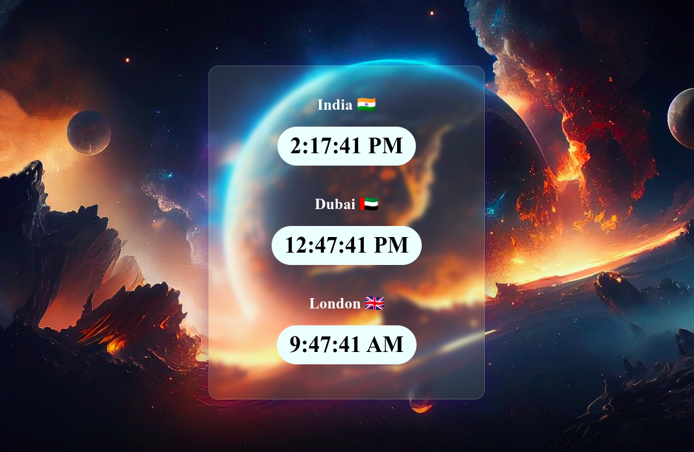

<h1>World Clock Project</h1>

  
This repository contains a world clock application built using HTML, CSS, and JavaScript. It displays the current time in multiple countries around the world.

  <h2>Project Overview</h2>

  
The JavaScript code retrieves the current time for each selected country and updates the clock displayed on the webpage in real-time.

  <h2>Screenshots</h2>
  

  <h2>Usage</h2>

  
Clone the repository to your local machine:

  <pre><code>git clone &lt;https://github.com/Dark-Programer/country-clock-html-css-js.git&gt;</code></pre>

  
Open the <code>index.html</code> file in your web browser to view the world clock application.

